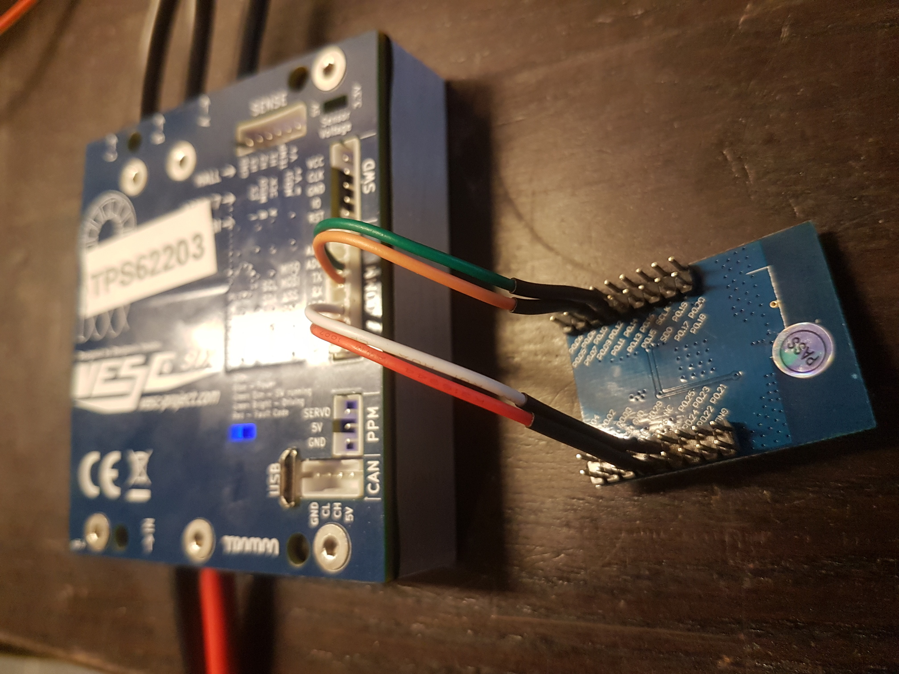

# nrf51_vesc

This is code for a NRF51822 for communicating between the VESC and VESC Tool (linux and mobile) over BLE. After uploading the firmware it can be connected to the VESC as in the picture, and the BLE scanner in VESC Tool should be able to find it and connect. Note that the UART port on the VESC must be enabled with a baud rate of 115200 for this to work.



This should work with any NRF51822 module, such as this one that I'm using:  
https://www.ebay.com/itm/Core51822-BLE4-0-Bluetooth-2-4G-Wireless-Module-nRF51822-Onboard-WS82013/281988119330?ssPageName=STRK%3AMEBIDX%3AIT&_trksid=p2057872.m2749.l2649

The code can be build with the NRF51822 sdk by changing the path in Makefile, but for convenience a prebuild hex file is also included. It can be uploaded with openocd by running the following script:

```bash
./upload_merged
```
The upload script assumes that the NRF51822 is connected over SWD using an stlink v2 with the following connection:

| NRF51822      | STLINK V2     |
| ------------- |---------------|
| GND           | GND           |
| VDD           | 3.3V          |
| SDO           | SWDIO         |
| SCL           | SWCLK         |

After that it can be connected to the VESC in the following way

| NRF51822      | VESC          |
| ------------- |---------------|
| GND           | GND           |
| VDD           | VCC (3.3V)    |
| P0.09         | RX            |
| P0.11         | TX            |

Note that a 10 uF ceremaic capacitor between vcc and gnd close to the NRF51 module might be needed if the cables are long. Otherwise the connection can become slow and unstable.

